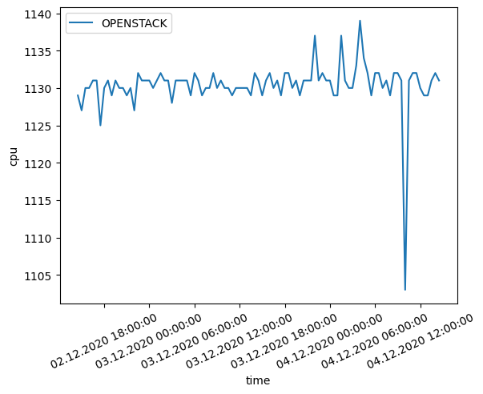
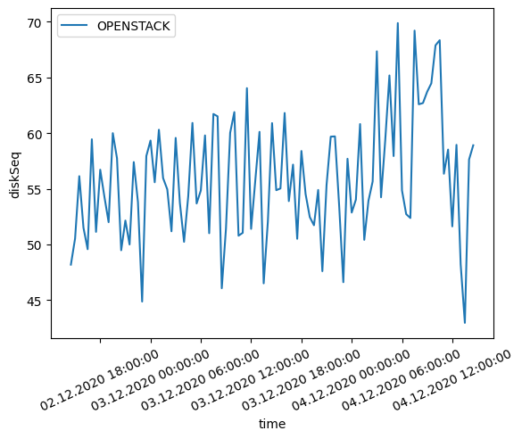

# Exercise 2

## 1. Virtual Machines

`spinup-gcp-for-openstack.sh`

```sh
# create cc-network1 and cc-network2 with custom subnet mode
gcloud compute networks create "cc-network1"\
                               --subnet-mode="custom"
gcloud compute networks create "cc-network2"\
                               --subnet-mode="custom"

# create cc-subnet1 for cc-network1 with subnet range 10.1.0.0/16 and secondary range 10.3.0.0/16
gcloud compute networks subnets create "cc-subnet1"\
                                       --network="cc-network1"\
                                       --range="10.1.0.0/16"\
                                       --secondary-range="vm-range"="172.16.0.0/20"\
                                       --region="europe-west1"

# create cc-subnet2 for cc-network2 with subnet range 10.2.0.0/16
gcloud compute networks subnets create "cc-subnet2"\
                                       --network="cc-network2"\
                                       --range="10.2.0.0/16"\
                                       --region="europe-west1"

# create disk with 100GB volume and ubuntu-1604-lts image
gcloud compute disks create "image-disk"\
                            --zone="europe-west1-b"\
                            --image-project="ubuntu-os-cloud"\
                            --image-family="ubuntu-1804-lts"\
                            --size="100GB"

# create new image from the previously created disk and add the license needed for nested vms
gcloud compute images create "nested-vm-image" \
                             --source-disk="image-disk"\
                             --source-disk-zone="europe-west1-b"\
                             --licenses="https://www.googleapis.com/compute/v1/projects/vm-options/global/licenses/enable-vmx"

# create controler vm instance as type n2-standard-2 using the nested-vm-image, cc tag, the two subnets and the secondary range in subnet1
gcloud compute instances create "controller"\
                                --zone="europe-west1-b"\
                                --machine-type="n2-standard-2"\
                                --image="nested-vm-image"\
                                --tags="cc"\
                                --network-interface subnet="cc-subnet1",aliases="vm-range":"172.16.1.0/24"\
                                --network-interface subnet="cc-subnet2"\
                                --can-ip-forward

# create compute1, compute2 vm instances as type n2-standard-2 using the nested-vm-image, cc tag and the two subnets
gcloud compute instances create "compute1"\
                                --zone="europe-west1-b"\
                                --machine-type="n2-standard-2"\
                                --image="nested-vm-image"\
                                --tags="cc"\
                                --network-interface subnet="cc-subnet1"\
                                --network-interface subnet="cc-subnet2"
gcloud compute instances create "compute2"\
                                --zone="europe-west1-b"\
                                --machine-type="n2-standard-2"\
                                --image="nested-vm-image"\
                                --tags="cc"\
                                --network-interface subnet="cc-subnet1"\
                                --network-interface subnet="cc-subnet2"

# allow all internal traffic in vpcs (only to cc tagged machines)
gcloud compute firewall-rules create "cc-network1-fw1" \
        --network="cc-network1"\
        --allow=tcp,udp,icmp\
        --target-tags="cc"\
        --source-ranges="10.1.0.0/16"
gcloud compute firewall-rules create "cc-network2-fw1" \
        --network="cc-network2"\
        --allow=tcp,udp,icmp\
        --target-tags="cc"\
        --source-ranges="10.2.0.0/16"

# allow ssh and icmp from all address ranges (only to cc tagged machines)
gcloud compute firewall-rules create "cc-network1-fw2"\
                              --network="cc-network1"\
                              --target-tags="cc"\
                              --allow=tcp:22,tcp:3389,icmp
gcloud compute firewall-rules create "cc-network2-fw2"\
                              --network="cc-network2"\
                              --target-tags="cc"\
                              --allow=tcp:22,tcp:3389,icmp

# allow all traffic for network1 (only to cc tagged machines)
gcloud compute firewall-rules create "cc-network1-fw3"\
                                     --network="cc-network1"\
                                     --target-tags="cc"\
                                     --allow=tcp,icmp

```

**Testing setup**:

```sh
# for each instance
VM1_EXTERNAL_IP=$(gcloud compute instances describe controller --format='get(networkInterfaces[0].accessConfigs[0].natIP)' --zone="europe-west1-b")
VM1_INTERNAL_IP1=$(gcloud compute instances describe controller --format='get(networkInterfaces[0].networkIP)' --zone="europe-west1-b")
VM1_INTERNAL_IP2=$(gcloud compute instances describe controller --format='get(networkInterfaces[1].networkIP)' --zone="europe-west1-b")
VM2_EXTERNAL_IP=$(gcloud compute instances describe compute1 --format='get(networkInterfaces[0].accessConfigs[0].natIP)' --zone="europe-west1-b")
VM2_INTERNAL_IP1=$(gcloud compute instances describe compute1 --format='get(networkInterfaces[0].networkIP)' --zone="europe-west1-b")
VM2_INTERNAL_IP2=$(gcloud compute instances describe compute1 --format='get(networkInterfaces[1].networkIP)' --zone="europe-west1-b")
VM3_EXTERNAL_IP=$(gcloud compute instances describe compute2 --format='get(networkInterfaces[0].accessConfigs[0].natIP)' --zone="europe-west1-b")
VM3_INTERNAL_IP1=$(gcloud compute instances describe compute2 --format='get(networkInterfaces[0].networkIP)' --zone="europe-west1-b")
VM3_INTERNAL_IP2=$(gcloud compute instances describe compute2 --format='get(networkInterfaces[1].networkIP)' --zone="europe-west1-b")

# Do this for all VMs (note down the internal ips to access them inside the vm)
ssh -i id_rsa ccuser@$VM1_EXTERNAL_IP
grep -cw vmx /proc/cpuinfo # has to be greater than 0
ifconfig # has to show 2 internal ips
ping <VM1_INTERNAL_IP1> # all other machines have to be reachable
ping <VM1_INTERNAL_IP2>
ping <VM2_INTERNAL_IP1>
ping <VM2_INTERNAL_IP2>
nc -z -v <VM1_INTERNAL_IP1> 22 # tcp traffic to all other machines has to work
nc -z -v <VM1_INTERNAL_IP2> 22
nc -z -v <VM2_INTERNAL_IP1> 22
nc -z -v <VM2_INTERNAL_IP2> 22
```

**Teardown**:

```sh
gcloud compute disks delete "image-disk" --zone="europe-west1-b"
gcloud compute instances delete controller --zone="europe-west1-b"
gcloud compute instances delete compute1 --zone="europe-west1-b"
gcloud compute instances delete compute2 --zone="europe-west1-b"
```

## Exercise 2

### Preparing kolla-ansible

```sh
# if your private key has a passphrase, use the following two lines to add your private key to the ssh-agent
# eval "$(ssh-agent -s)"
# ssh-add id_rsa
pip install 'ansible<2.10' kolla-ansible
sudo mkdir -p /etc/kolla
sudo chown $USER:$USER /etc/kolla
cp -r <path_to_venv>/share/kolla-ansible/etc_examples/kolla/* /etc/kolla
# run a sudo command to enter your password before running the deploy-openstack.sh commands
# sudo echo "lol"
# ssh to all machines to accept finger prints
ssh ccuser@$VM1_EXTERNAL_IP -i id_rsa
ssh ccuser@$VM2_EXTERNAL_IP -i id_rsa
ssh ccuser@$VM3_EXTERNAL_IP -i id_rsa

cd kolla-ansible
ansible -m ping all -i ./multinode
```

### Fixing RabbitMQ hostname bug

```sh
# ssh into all machines and remove all entries with "Added by Google"
sudo nano /etc/hosts
```

## Exericse 3

### OpenStack Client

```sh
# install openstack cli
pip install python-openstackclient

# get password from passwords.yml
cat passwords.yml | grep "keystone_admin_password"

# Get the controller IP (`echo $VM1_EXTERNAL_IP`) and open the brower
# login with admin & the password from above

# Download the admin-openrc.sh (dropdown upper right corner) and
source admin-openrc.sh

# test openstack CLI
openstack host list

# run the scripts
chmod +x *.sh
./import-images.sh
./create-ext-network.sh

```

`prepare-openstack.sh`

```sh

# create security group "open-all"
openstack security group create open-all
# add wide open rules for all tcp/udp and icmp traffic to the newly created security group
openstack security group rule create --proto tcp --remote-ip 0.0.0.0/0 --dst-port 1:65525 open-all
openstack security group rule create --proto udp --remote-ip 0.0.0.0/0 --dst-port 1:65525 open-all
openstack security group rule create --proto icmp --remote-ip 0.0.0.0/0 open-all

# create keypair for openstack
openstack keypair create openstack_id_rsa > openstack_id_rsa
CONTROLLER_EXTERNAL_IP=$(gcloud compute instances describe controller --format='get(networkInterfaces[0].accessConfigs[0].natIP)' --zone="europe-west1-b")
scp -i id_rsa openstack_id_rsa ccuser@$CONTROLLER_EXTERNAL_IP:/home/ccuser/openstack_id_rsa
ssh ccuser@$CONTROLLER_EXTERNAL_IP -i id_rsa chmod 400 openstack_id_rsa

# create VM instance with ubuntu image, medium flavor, admin-net, default security group and the imported public key
nova boot --image="ubuntu-16.04"\
          --flavor="m1.medium"\
          --nic net-name="admin-net"\
          --security-groups="open-all"\
          --key-name="openstack_id_rsa"\
          instance1

# allocate floating ip and retrieve it from the output
floating_ip=$(openstack floating ip create --project admin\
                             --subnet external-sub external\
                             --format="value"\
                             --column="floating_ip_address")


# associate the floating ip to the instance we created earlier
openstack server add floating ip instance1 $floating_ip
```

```sh
# copy iptables-magic.sh to controller vm
scp -i id_rsa ../iptables-magic.sh ccuser@$VM1_EXTERNAL_IP:/home/ccuser/iptables-magic.sh
ssh ccuser@$VM1_EXTERNAL_IP -i id_rsa chmod +x iptables-magic.sh
ssh ccuser@$VM1_EXTERNAL_IP -i id_rsa sudo sh iptables-magic.sh

# ssh to the gc controller (make note of the floating ip)
ssh ccuser@$VM1_EXTERNAL_IP -i id_rsa

# from within the gc controller, ssh into the vm
ssh ubuntu@<FLOATING_IP> -i openstack_id_rsa

```

### Making accessible from external (this does not work)

```sh
CONTROLLER_EXTERNAL_IP=$(gcloud compute instances describe controller --format='get(networkInterfaces[0].accessConfigs[0].natIP)' --zone="europe-west1-b")

# specify alias ip range and floating ip range
ALIAS_IP_RANGE=172.16.1.0/24
FLOATING_IP_RANGE=10.122.0.0/24

# add netmapping of alias ip range to floating ip range
# this allows addresses of kind 172.16.1.xxx be routed to 10.122.0.xxx
# ip forwarding is enabled by default
ssh ccuser@$CONTROLLER_EXTERNAL_IP -i id_rsa sudo iptables -t nat -A PREROUTING -d $ALIAS_IP_RANGE -i ens4 -j NETMAP --to $FLOATING_IP_RANGE
ssh ccuser@$CONTROLLER_EXTERNAL_IP -i id_rsa sudo iptables -t nat -A POSTROUTING -s $FLOATING_IP_RANGE -j MASQUERADE

```

## Exercise 4

```sh
sudo apt-get update
sudo apt-get install sysbench bc

# copy benchmarking files
# add crontab
```

### Plots





